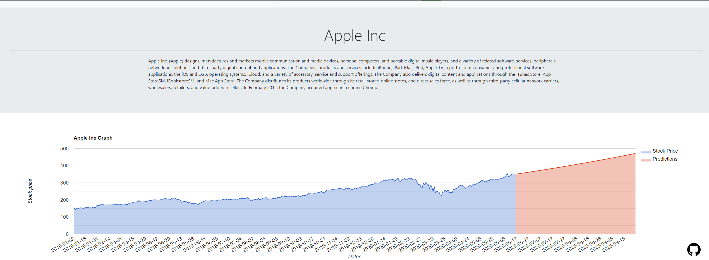
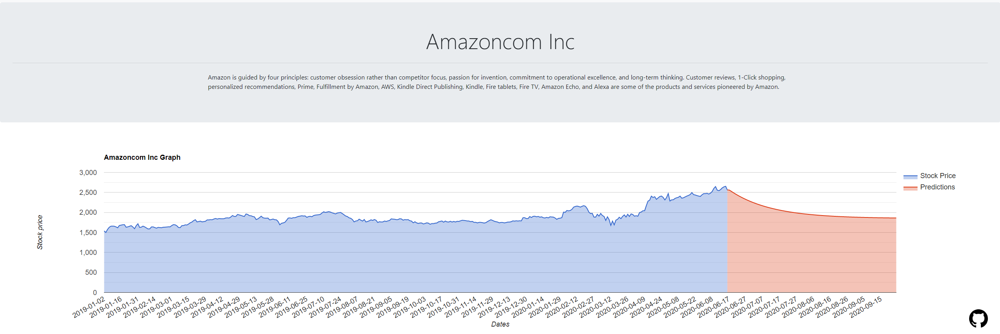

# FlareStocks

## 🚀 Local Development

```sh
git clone https://github.com/aaditgupta21/FlareStocks.git
pip3 install -r requirements.txt
python3 data/extract_data.py
python3 AI/AI.py
python3 app.py

DISCLAIMER: Needs to be updated everyday to get precise predictions
```

## 👨‍💻 Contact

Github: [aaditgupta21](https://github.com/aaditgupta21)
<br>
Devpost: [Aadit Gupta](https://devpost.com/aaditgupta21)

## Screenshots




## 🤝 Contributing

Contributions, PRs, issues and feature requests are welcome! Feel free to check out our [issues page](https://github.com/aaditgupta21/FlareStocks/issues).

## ❤️ Show your support

Give a ⭐️ if this project helped you!
Hope you enjoy!
